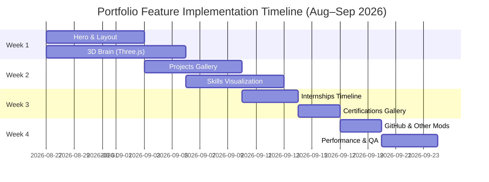

# Executive Summary  
Modern developer portfolios blend sleek visuals, subtle motion, and clear organization. We recommend a **dark-first editorial theme** (dark background, high-contrast accent color, cinematic typography) with an **interactive hero section** (e.g. portrait + layered/3D elements). Key features include a Three.js-powered “brain” graphic (for tech flair), animated Framer Motion effects (entrances, staggered reveals, hover/magnetic CTAs, shimmer) throughout, and well-structured sections for projects, skills, GitHub, and experiences. Each feature below is actionable, performant, and accessible. We cite successful portfolios and best-practice guides to justify each choice. The final section lists 10–15 exemplary portfolio URLs (with notes) and provides a feature-priority checklist and a 4-week implementation timeline (mermaid Gantt).  

## Visual Design & Hero Section  
 Modern dev portfolios often use dark, high-contrast backgrounds and bold typography to create an **editorial, cinematic** feel. A fullscreen **hero/banner** is critical: consider a layered layout with a large *portrait or profile illustration*, tagline, and a subtle parallax or 3D effect (e.g. depth layers moving on scroll) to immediately convey identity. Using a dark hero with white/accent text (as Brittany Chiang does) draws attention to the title/CTA. Integrate interactive elements – e.g. a dynamic overlay or an animated background (video or WebGL) – to engage users without overwhelming them. For example, Devon Stank’s portfolio uses a **video background** behind a dark layout to great effect.  

- **Why it works:** A strong hero sets tone and brand instantly. Dark-themed designs feel modern and focus the eye on content (as in Brittany Chiang’s site and Tamal Sen’s IDE-like dark theme). A layered portrait with motion (fade/slide) introduces the author personally, increasing connection.  
- **Implementation notes:** Structure as a React component with layered `div`s: one for background (image/video/Three.js canvas) and one for foreground text/portrait. Use Framer Motion’s `<motion.div initial={…} animate={…}>` to fade-in the portrait and text on load (e.g. `opacity` from 0 to 1, or slide from side). A simple parallax effect can be done by translating background layers slower than scroll using a `useScroll` hook or CSS transforms. For example:
  ```jsx
  <motion.div initial={{opacity:0}} animate={{opacity:1}} transition={{duration:1}}>
    
    <h1 className="text-5xl font-bold">Hello, I'm [Name]</h1>
    <p className="mt-4">I build web experiences.</p>
  </motion.div>
  ```
  A subtle **parallax/3D effect** can be achieved using CSS `transform: translateZ()` on layered elements or Three.js (see below).  
- **Complexity:** *Medium–High* (requires design and motion planning).  
- **Caveats:** Ensure text is legible over backgrounds (use overlays or color filters). Test on mobile (parallax often disabled on mobile). Always provide a “skip to content” link or ensure keyboard navigation is possible.  

## Three.js / 3D Brain Visualization  
Incorporate a **3D interactive brain or network** (inspired by the user’s uploaded image) using Three.js (or React Three Fiber). This could be the hero’s centerpiece or a featured section. For example, Bruno Simon’s portfolio uses a full WebGL environment driven by Three.js. A brain model with animated neuron lines can symbolize neural networks/AI and catch the eye. It could slowly rotate or respond to mouse/touch, and transition into view with Framer Motion (e.g. fade+scale).  

- **Why it works:** A custom 3D graphic immediately signals advanced technical skill and creativity. It differentiates the portfolio (see how Bruno’s car scene captures attention) and reinforces a “tech/AI” theme, matching the brain motif. It can also serve as a visual metaphor (e.g. “I program complex networks”).  
- **Implementation notes:** Model a low-poly brain and neuron lines in Three.js. Use `react-three-fiber` (R3F) for React integration. For example, load a Brain model (GLTF/GLB) and an animated particle/network overlay. Use R3F’s `<Canvas>` and Three.js shaders or particle systems. You can animate the model with Three.js or react-spring. Example pseudocode:
  ```jsx
  import { Canvas, useFrame } from '@react-three/fiber';
  function BrainScene() {
    const ref = useRef();
    useFrame(() => ref.current.rotation.y += 0.001);
    return <mesh ref={ref} /* geometry=brainModel */ /* material=matcap */ />;
  }
  ...
  <Canvas>
    <ambientLight intensity={0.5} />
    <BrainScene />
    {/* optional neuron lines with <lineSegments> */}
  </Canvas>
  ```
  Combine with Framer Motion’s `AnimatePresence` for mounting transitions (`scale: 0.8 → 1`, `opacity: 0 → 1`).  
- **Complexity:** *High* (3D modeling and optimization needed).  
- **Caveats:** Three.js is heavy; optimize by using low-poly models, matcap materials (as Bruno did to avoid dynamic lights), and throttle animations. Ensure `prefers-reduced-motion` turns off or simplifies animation. Provide a static fallback image for older browsers or low-power devices. Keep scenes lightweight and test frame rate.  

## Framer Motion Patterns & Interactions  
Use Framer Motion to animate content throughout. Key patterns: **entrances and scroll reveal**, **staggered sequences**, **hover effects**, **magnetic CTA buttons**, and **shimmer/light sweeps** on highlights. Examples of good use: Monica Dinculescu’s site has fun interactive side projects, Cassie’s site toggles a lamp for light/dark, and many use smooth fades on scroll.  

- **Entrance/Stagger:** Animate sections or list items as they enter the viewport (e.g. fade+slide up). Use Framer’s `<motion.div initial={{opacity:0,y:50}} whileInView={{opacity:1,y:0}} transition={{duration:0.6}} />`. Stagger lists (e.g. project cards) using `<AnimatePresence>` and variants with `staggerChildren` for a polished flow.  
- **Hover animations:** For project cards or links, use `whileHover={{ scale: 1.02 }}` or slightly rotate elements. Framer’s `hover` and `tap` props make this easy. Magnetic buttons: track mouse position and displace the button slightly towards the cursor (Framer’s `useMotionValue`, `onMouseMove` with x/y transforms).  
- **Shimmer effect:** A subtle highlight sweep across buttons or badges. CSS approach: use `background: linear-gradient( to right, transparent, rgba(255,255,255,0.2), transparent )` and animate the background position with Framer’s `animate={{ backgroundPosition: ["-200%", "200%"] }}`.  
- **Implementation notes:** Stick to animating `transform` and `opacity` for best performance. For example, define motion variants:
  ```jsx
  const cardVariants = { hidden: { opacity:0, y:30 }, visible: { opacity:1, y:0 } };
  <motion.div variants={cardVariants} initial="hidden" whileInView="visible" viewport={{ once:true }} />
  ```
  Use `whileHover={{ scale:1.05 }}` on interactive elements. For magnetic effect, attach an `onMouseMove` handler on the parent container to update the button’s `x/y` via `useMotionValue`, then animate back on `whileHoverEnd`.  
- **Complexity:** *Medium* (depends on number of effects).  
- **Caveats:** Respect reduced motion: wrap animations in `useReducedMotion()` to disable/alt animations if needed. Avoid animating layout-changing properties (like width/height) as they trigger reflow. Instead use CSS transforms. Test on low-power devices.  

## Project & Content Presentation  
Showcase work with **interactive cards or galleries**. For example, Constance Souville’s portfolio displays projects in an animated grid. Use a **card grid** for projects, each with an image/illustration, title, short description. On hover/click, expand or open a modal/details. Optionally, allow filtering by tech (buttons that filter the grid with animation). Use Framer Motion to animate these transitions and to hover-highlight cards.  

- **Why it works:** Organized project cards let visitors scan easily. Animations and hover reveal add delight (e.g. Adam Hartwig’s lively projects list).  
- **Implementation notes:** Use CSS Grid/Flex for layout, with a React array of project data. Example:
  ```jsx
  projects.map((proj,i) => (
    <motion.div key={i} variants={cardVariants} whileHover={{ scale:1.02 }}>
      
      <h3>{proj.title}</h3>
      <p>{proj.blurb}</p>
    </motion.div>
  ))
  ```
  For modal/detail views, use Framer’s `<AnimatePresence>` to fade in a full-screen panel on click. Maintain content in JSON/YAML data files to avoid hardcoding.  
- **Complexity:** *Medium.*  
- **Caveats:** Ensure images are optimized (compressed, responsive `srcset`). Lazy-load off-screen images. Provide alt text for accessibility. If using a carousel, ensure keyboard support.  

## Skills & Technology Visualization  
Instead of a plain list, consider a **network or map graphic** to illustrate skills (e.g. nodes for languages/frameworks). For example, an interactive graph of connected nodes (D3.js or Three.js). Alternatively, a world map highlighting locations of interest. If too complex, a styled list (columns of skill names or proficiency bars) is a simpler fallback.  

- **Why it works:** Visualizing skills (especially connections or language families) engages viewers. A “tech tree” or force-directed graph can highlight expertise in an eye-catching way. It also allows hover interactions (display proficiency or projects using that tech).  
- **Implementation notes:** Use a lightweight graph library (e.g. react-force-graph or d3-force with SVG/canvas) or Three.js for 3D nodes. Use Framer Motion to fade in/out details. Provide a plain list version for small screens or `prefers-reduced-motion`.  
- **Complexity:** *High.*  
- **Caveats:** Complex visualizations can be heavy; optimize by limiting nodes or using canvas. Provide `alt` descriptions or a fallback list for screen readers. For performance, pause animations if `prefers-reduced-motion: reduce`.  

## GitHub Integration  
Include dynamic GitHub data: e.g. pins of top repos, contribution calendar, or language stats. Many portfolios embed GitHub libraries or REST API calls. Keep it simple: fetch via GitHub API (or use a plugin like [react-github-btn](https://github.com/ntkme/github-btn)) to display star counts.  

- **Why it works:** Shows real work and activity. Visitors can see code examples and contributions. Examples like Kaleb McKelvey’s site combine project blogs with GitHub links.  
- **Implementation notes:** Use GitHub’s GraphQL or REST API to fetch repositories and stats, then render cards or a chart. E.g. fetch `fetch('https://api.github.com/users/yourUser/repos')` and map to components. Could also embed the GitHub contributions calendar image (via GitHub profile API) or use a library for charts.  
- **Complexity:** *Low–Medium.*  
- **Caveats:** Do not expose sensitive tokens; use public APIs with rate limits. Consider SSR or static-build plugins to avoid client-side slowness. Keep count of API calls for performance.  

## Internships & Certifications  
Use a **timeline or grid** for work experience and certificates. For internships, a vertical timeline (with years/months) or horizontal slider works. Highlight company logos and role, with Framer-driven reveal on scroll. For certificates, a clickable gallery (e.g. lightbox to enlarge) or grid layout is effective.  

- **Implementation notes:** A simple timeline can be built with CSS Flex/Grid plus absolute positioning for connectors. Use motion to animate each entry (e.g. slide in from side). Sample pseudocode:
  ```jsx
  <motion.div whileInView={{ x:0, opacity:1 }} initial={{ x:-50, opacity:0 }}>
    <h4>📍 {intern.company}</h4>
    <p>{intern.role} ({intern.duration})</p>
  </motion.div>
  ```
  For certifications, render images/logos in a responsive grid; on hover, overlay a brief title or date.  
- **Complexity:** *Low–Medium.*  
- **Caveats:** Ensure text is readable and color-contrasted. Use actual text for company names (not just logos) for accessibility.  

## Accessibility, Performance & SEO  
Address these foundational concerns:  
- **Reduced motion:** Honor `prefers-reduced-motion` by disabling or simplifying animations if the user requests. For example, wrap Framer components with `useReducedMotion()` to avoid complex transitions.  
- **Semantic HTML:** Use headings (`<h1>–<h6>`), landmarks (`<nav>`, `<main>`), and alt text for images. Ensure focus states on interactive elements.  
- **Contrast & Fonts:** Keep text readable (WCAG contrast). Use system or web-safe fonts for fast loading. Editorial sites often use a single accent color for highlights.  
- **Performance:** Lazy-load images and 3D canvas (`<Suspense>` or conditional loading). Optimize Framer Motion by animating only transform/opacity for 60–120fps. Avoid layout thrashing (no heavy CSS properties). Minify and compress assets, use CSS-in-JS or Tailwind JIT for minimal CSS.  
- **SEO:** Use meta tags and semantic titles. Provide a textual summary of work/skills so content isn’t purely in scripts. Use `title`, `meta description`, and `<h1>` on the homepage. Test with tools (Lighthouse) to ensure good score.  

## Exemplary Portfolio Websites  
Below are 10–15 notable developer portfolios. Each illustrates valuable ideas:  

- **Brittany Chiang** (https://brittanychiang.com) – *Dark, minimalist design:* Full-screen hero with bold title & CTA, floating social links, sticky header. Shows the power of simple, high-contrast layout.  
- **Bruno Simon** (https://bruno-simon.com) – *3D interactive portfolio:* Drive a 3D car in a WebGL environment to explore content. Built with Three.js, it’s an extreme example of immersive storytelling and performance tuning.  
- **Cassie Evans** (https://cassie.codes) – *Playful interactions:* A lamp graphic toggles light/dark mode. Her site has many small UX delights (e.g. hover hints), showing how micro-interactions add personality.  
- **Sharlee (Charles Bruyerre)** (https://itssharl.ee) – *Animated background:* Features a dynamic particle/shape animation, full-screen layout with day/night switch. The overlaid hamburger menu and language toggle demonstrate accessible responsive nav.  
- **Monica Dinculescu** (https://meowni.ca) – *Colorful UI & experiments:* Projects (like Tiny Care Terminal) are center stage. Her menu and regenerate-artwork button shows experimental interaction in portfolios.  
- **Jhey Tompkins** (https://jhey.dev) – *Design mimicry:* Portfolios/articles styled like Twitter, blending content and design. It exemplifies branding creativity, using familiar UI patterns in unexpected ways.  
- **Adam Hartwig** (https://adamhartwig.co.uk) – *Vibrant animations:* Lively color palette and playful graphics draw in viewers. He injects fun into otherwise standard project lists with animated transitions.  
- **Lars Olson** (https://lars-olson.com) – *Spacey/retro aesthetic:* A 90s-futuristic vibe with floating 3D objects and custom typography. His single-page site is clean, showing classic portfolio structure with creative art direction.  
- **Tamal Sen** (https://tamalsen.dev) – *IDE-themed dark style:* Uses code-snippet backgrounds and a dark, “developer IDE” look. Effective for demonstrating coding persona; projects are showcased via screenshots in a dynamic gallery.  
- **Constance Souville** (https://constancesouville.com) – *Editorial grid:* Minimal magazine-like layout with a dynamic grid of work. Smooth scroll animations and hover highlights reveal project details in a refined way.  
- **Mason Wong** (https://masontywong.com) – *Retro-futuristic visuals:* Holographic and fluid animations, with neon color pops. Bold style that keeps a portfolio memorable, using smooth page transitions.  
- **Ewan Kerboas** (https://ewan-kerboas.fr) – *Monochrome elegance:* Clean black-and-white theme with splashes of neon, category filters for projects. Its simplicity emphasizes content without distractions.  
- **Rob Bowen** (https://robbowen.digital) – *Sleek simplicity:* Straightforward site with clear section menu, everything accessible without long scroll. A reminder that easy navigation can be as powerful as flashy design.  
- **Lauren Waller** (https://lauren-waller.com) – *Typographic hero:* Large text-based hero directing to work/contact, simple page structure. Demonstrates that strong typography alone can make an impact.  
- **Lynn Fisher** (https://lynnandtonic.com) – *Yearly redesigns & toggle:* Redesigns portfolio annually; current one has white/dark modes with witty text (“waste time here”). Shows creative use of light/dark switching and humor.  
- **Rafael Caferati** (https://caferati.me) – *Gamified entry:* Requires “destroying” the homepage in a brief game to unlock content. While extreme, it illustrates how interactive storytelling can engage visitors.  

Each of these sites combines unique design with developer-first sensibilities (performance and clarity). They can inspire features above (e.g. Bruno for Three.js, Sharlee for animated hero, Cassie for mode toggle, etc.).  

## Feature Priority Checklist (for Swayam)  
1. **Cinematic Hero & Portrait** – Bold intro immediately (high impact).  
2. **Interactive 3D Brain** – Memorable showcase of skill (high).  
3. **Animated Project Gallery** – Clean cards with hover/Modal (high).  
4. **Skill Visualization** – Interactive map or graph (high).  
5. **Shimmer & Magnetic CTAs** – Eye-catching buttons (medium).  
6. **Internship/Experience Timeline** – Structured history (medium).  
7. **Certifications Gallery** – Display course logos (medium).  
8. **GitHub Integration** – Show repo highlights or stats (low-medium).  
9. **Dark/Light Mode Toggle** – If not already, add switch (low).  
10. **Accessibility & Perf Enhancements** – Always integrate (ongoing).  

Top priorities (1–4) should come first; they offer the biggest UX impact. Shimmer/CTAs and internships come next. GitHub and theme toggle can follow.  



**Sources:** Best practices and portfolio examples cited above. Each recommendation is drawn from real portfolio patterns and technical guidelines.